# Generative Adversarial Networks
> Presented here are some GAN architectures from my Master Thesis that generate MNIST and CelebA data and that solve Inpainting Problems.

Generative Adversarial Networks pose a powerful tool to learn distributions of data and are "the most interesting idea in machine learning since the last ten years" [according to Yann LeCun](https://medium.com/thecyphy/gans-what-and-where-b377672283c5). A Generative Adversarial Network (GAN) uses at its core the idea to let two neural networks compete against each other as players in a minimum-maximum (minmax or minimax) optimization game.\
The game consists of two players, namely the generator $G$ and the discriminator $D$. For a given data set, the generator takes samples from a random probability distribution as input and produces fake data that is supposed to be as "similar" as possible to the real data. The discriminator takes as input both real and generated fake data and tries to discern, whether its input was indeed real or not. We can think of the generator as an art forger who tries to copy the paintings of an artist and we can think of the discriminator as the detective who examines the authenticity of both real and forged paintings. During the game, the forger and the detective become better at their function until the forger can produce perfect forgeries and the detective cannot tell anymore, whether the paintings are real or not. These players are usually represented by two neural networks and we train both the generator and the discriminator in an alternating fashion until they reach a Nash equilibrium.
<!---
In short, we optimize to find the saddle point, and the solution to the optimization problem The architecture of these networks is itself a hyper parameter or variable that can be tuned in order to achieve a better game. This is why a GAN should rather be thought of as a game theoretical concept.
--->
## Sampling from image data sets

Following images were sampled from a GAN trained on the [MNIST dataset](http://yann.lecun.com/exdb/mnist/) of handwritten digits.

## Theory
Let the training data $X$ follow some probabilistic distribution $\mu$ and let $Z$ be the latent variable, distributed according to some law $\gamma$ (typically Gaussian).
 Let $G_\theta$ be the Generator network with parameters $\theta$ and let $D_\omega$ be the Discriminator network with parameters $\omega$.
 Let 
 
 
 
  be the value function.
A Generative Adversarial Network (GAN) is defined as the minimax optimization game $$\min_\theta \max_\omega V(D_\omega,G_\theta).$$ 
The generator $G$ maps the latent random variable $Z$ to points "similar" to real data in $X$, generating fake data. For any $x$, $D_\omega(x)$ is supposed to estimate the probability of $x$ being a real data point, and not a generated one. For a fixed $G_\theta$, the objective $\max_\omega V(D_\omega,G_\theta)$ means that we have for the optimal player $D_\omega^*$,

For a fixed $D_\omega$, the objective $\min_\theta\  V(D_\omega,G_\theta)$  means on the contrary that for the optimal player $G_\theta^*$, we have 

Solving the minimax optimization means finding the saddle point or so-called Nash equilibrium 

for which we have

for all $\omega$ and $\theta$. The trained GAN produces a generator-discriminator pair that solve the min max objective.
Both $\omega$ and $\theta$ are iteratively updated such that the probability distribution of $G_\theta(Z)$ approaches $\mu$ and $D_\omega$ is optimized to map real data points $X$ to 1 and to map generated data points to 0.
After a perfect game, the discriminator $D$ will be unable to discern, whether $x$ is generated or not, i.e. we have $D(x)=\dfrac{1}{2}$ for both generated and real $x$ and we can virtually sample from the unknown $\mu$ by  sampling from $G(Z)$ instead.

## Inpainting 
In this experiment, we want to solve an inpainting problem with a cGAN. For some image data $x \in \mathbb{R}^{m\times n},\ m,\ n \in \mathbb{N}$, we define the operator $y=f_{crop}(x) = x_{i:j=0}$, where for some length $l\in\{1,\ldots,\min(m,n)-1\}$, we set a rectangle $[i,i+l]\times[j,j+l],\ i\in\{0,\ldots,m-l\},\ j\in\{0,\ldots,n-l\}$ of the image $x$ to zero and pass it to a conditioning network $C_\theta: \mathbb{R}^{m\times n}\to\mathbb{R}^{l\times l}$, which is a convolutional neural network. An example of this can be seen below with MNIST image data. The idea to use $C_\theta$ was inspired by [Ardizzone et al., 2020](https://arxiv.org/pdf/2105.02104.pdf) and the hope is that this network can capture global semantic features of the image.

![MNIST_inp_x]  ![MNIST_inp_y]  ![MNIST_inp_cy]

Data $x$ (left), cropped image $y$ (centre), and output of the conditional net $C_\theta(y)$ (right).

We expand our generator parameters to $\theta=(\theta_{G}, \theta_C)$ and concatenate samples $z$ from $\gamma$ with $C_\theta(y)$ to pass it to the conditional generator $G_\theta:Z\times\mathbb{R}^{l\times l}\to \mathbb{R}^{l\times l}$. Finally, we pad $G_\theta(z, C_\theta(y))$ with zeros and add it to the original cropped image so that we have the new discriminator input

and solve the GAN objective

as usual. An example for these generated images can be seen below, where we can see that the generator filled the cropped space with sensible images, such that we even produce different digits that could make up the empty space.  

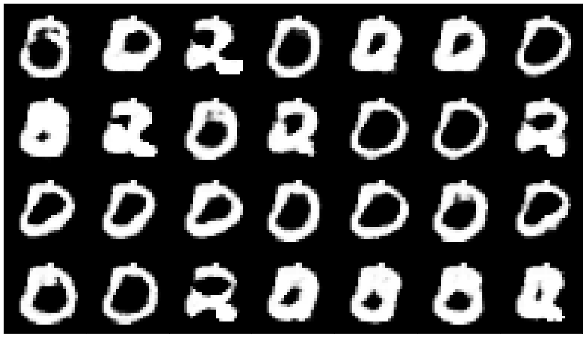

The cropped-out space has been filled by the network meaningfully.

### SiC Diamonds

This can be a useful application for image data with artifacts, where we replace the artifacts with generated patches. A real-world application of this can be seen next.
A series of multi-scale 3D images has been acquired by synchrotron
micro-computed tomography at the SLS beamline TOMCAT. The material consists of a composite ("SiC Diamonds") obtained by
microwave sintering of silicon and diamonds, see [Vaucher et al., 2007](https://www.semanticscholar.org/paper/On-line-tools-for-microscopic-and-macroscopic-of-Vaucher-Unifantowicz/49285bdfb20d2429791f79ad601216e0c5d6acb2).
We consider in our experiments the SiC Diamonds images with a voxel
spacing of $1.625$ micrometers and crop several 2D slices of the size $600 \times 600$ pixels.
From this image data, we randomly select 32x32 pixel patches and crop out 18x18 pixel rectangles with $f_{crop}$ in order to produce the training data below.

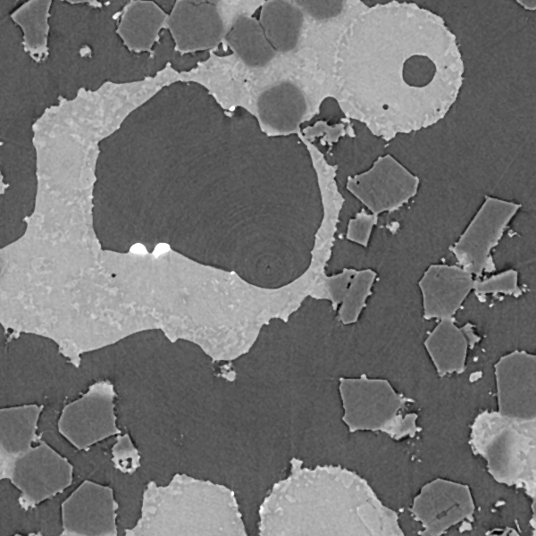

Example CT image of the SiC diamonds. Only one image is necessary for training.

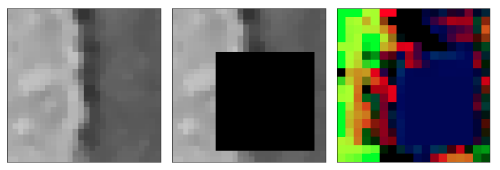

Patch $x$ (left), cropped patch $y$ (centre), and output of the conditional net $C_\theta(y)$ (right).

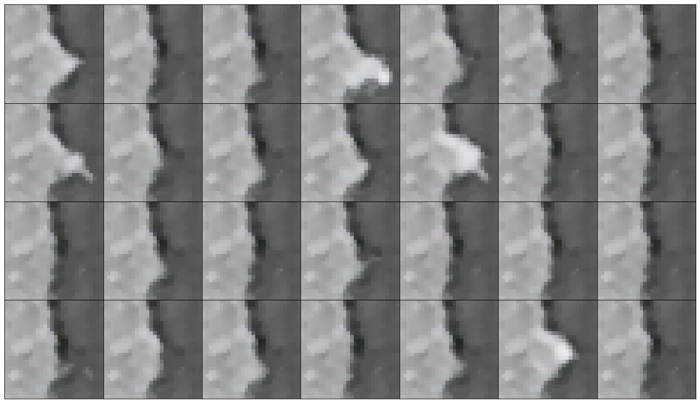

Generated inpaintings for the patch.

More Examples:

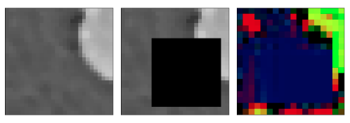

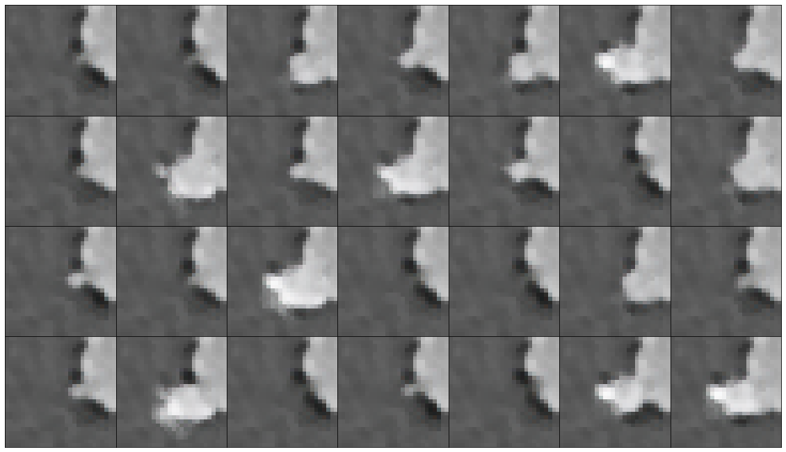

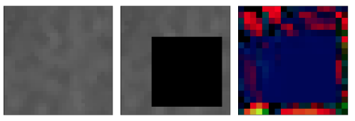

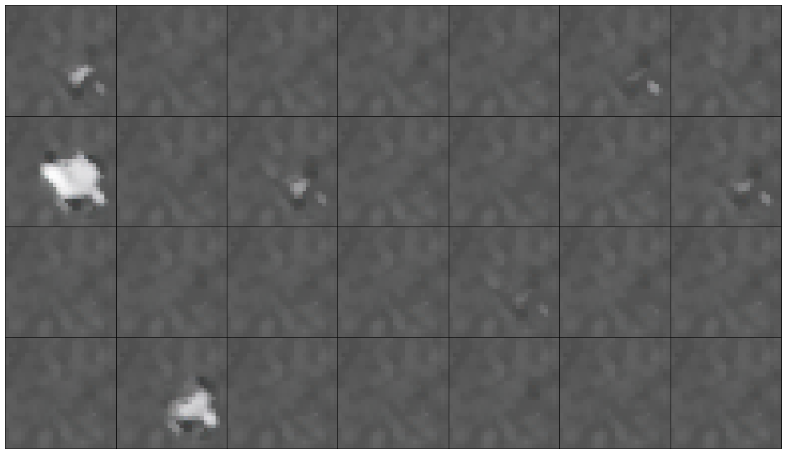

It is also possible to take the mean and calculate the standard deviation of the generated images to allow for quantification of the uncertainty. This can be seen below, where we took the mean and calculated the standard deviation over a batch of 5000 generated samples. This allows us to gain more insights about the data. Assuming that the generator correctly learned the data distribution, we can judge the uniqueness of the solution for this inverse problem by the standard deviation of the generated samples.

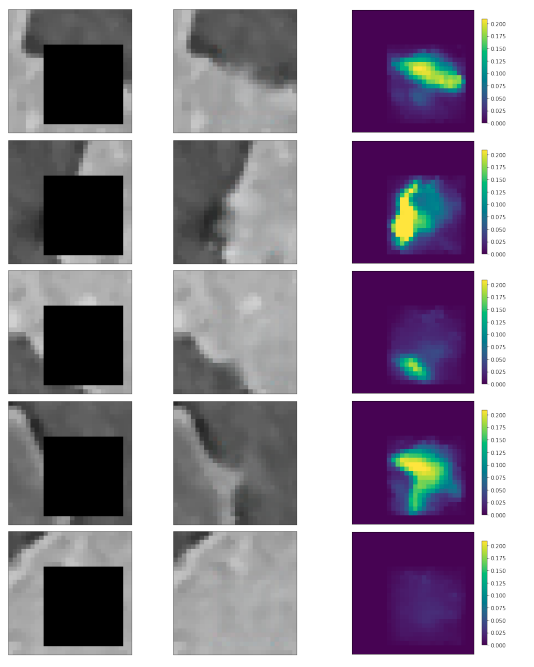

Cropped patch $y$ (left), mean over generated samples (centre), and standard deviation of the generated samples (right).

## GAN Architectures

### CelebA Sampling

for the celebA dataset, the following architecture was used: 

for the generator

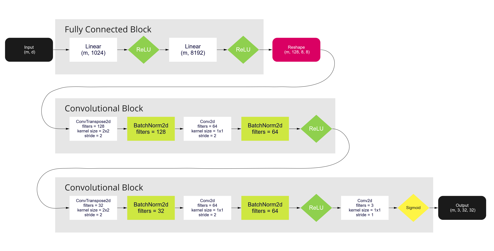

and for the discriminator

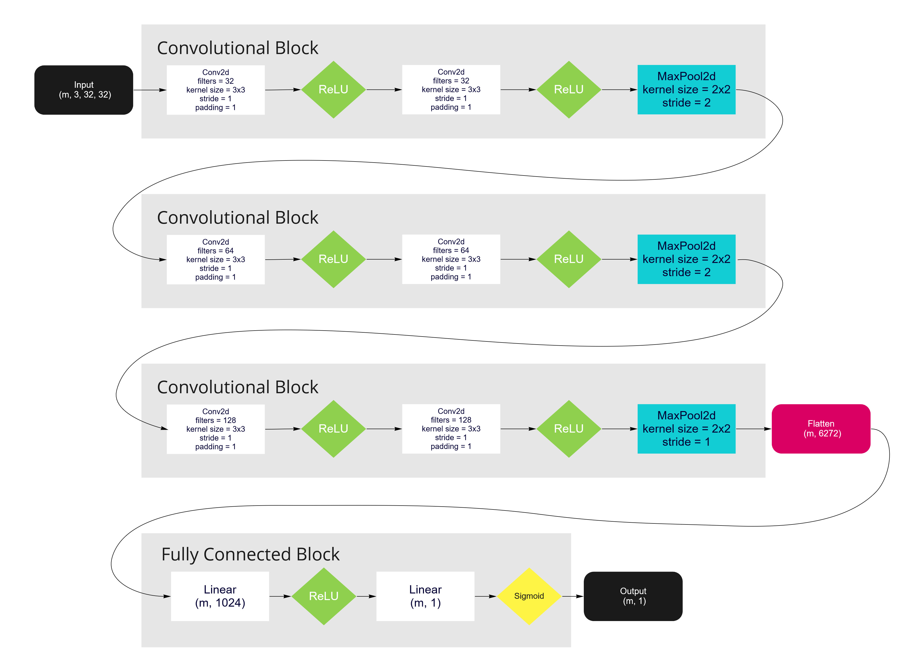

### Inpainting

discriminator

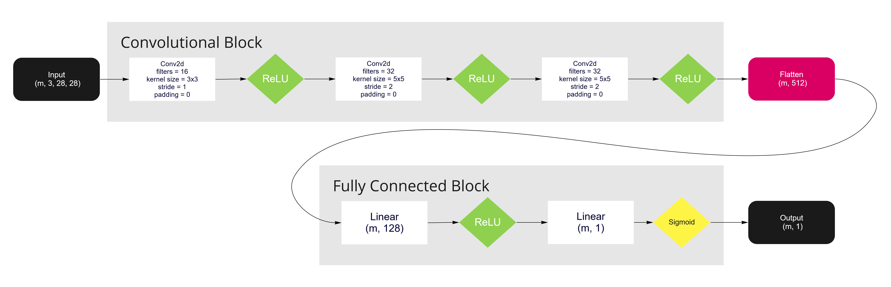

and for the generator

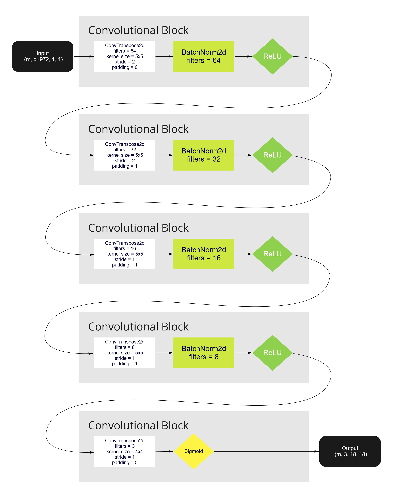

and with the conditional net

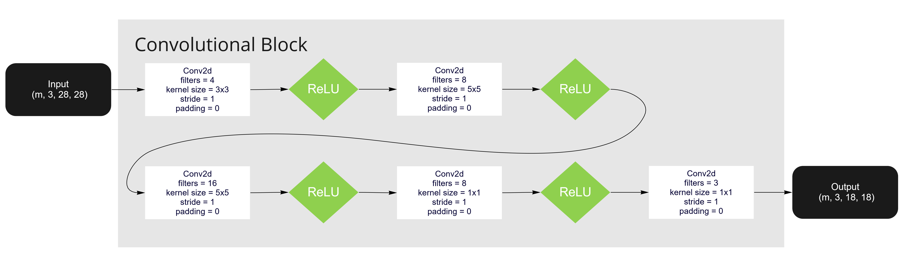

<!-- Markdown link & img dfn's -->
[MNIST_inp_x]: ./Pictures/x_inp_mnist.png
[MNIST_inp_y]: ./Pictures/y_inp_mnist.png
[MNIST_inp_cy]: ./Pictures/yinp_inp_mnist.png

[npm-url]: https://npmjs.org/package/datadog-metrics
[npm-downloads]: https://img.shields.io/npm/dm/datadog-metrics.svg?style=flat-square
[travis-image]: https://img.shields.io/travis/dbader/node-datadog-metrics/master.svg?style=flat-square
[travis-url]: https://travis-ci.org/dbader/node-datadog-metrics
[wiki]: https://github.com/yourname/yourproject/wiki

