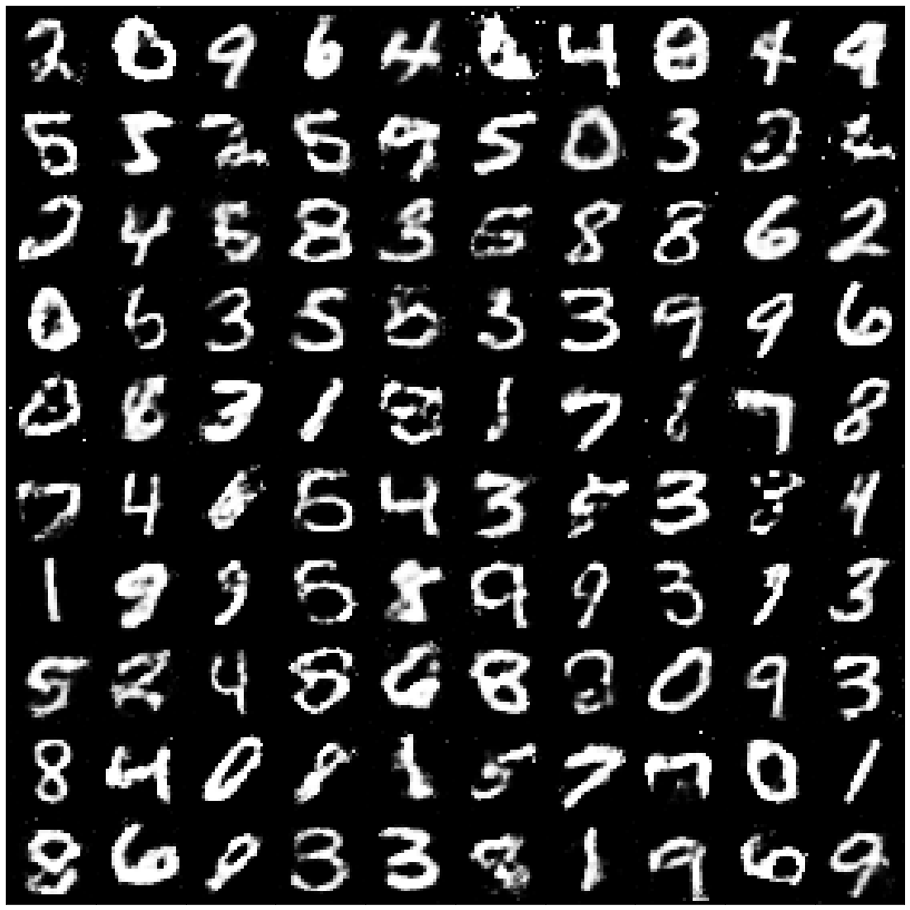

# Generative Adversarial Networks
> Presented here are some GAN architectures from my Master Thesis that generate MNIST and CelebA data and that solve Inpainting Problems.

Generative Adversarial Networks pose a powerful tool to learn distributions of data and are "the most interesting idea in machine learning since the last ten years" according to Yann LeCun (https://medium.com/thecyphy/gans-what-and-where-b377672283c5). A Generative Adversarial Network (GAN) uses at its core the idea to let two neural networks compete against each other as players in a minimum-maximum (minmax or minimax) optimization game.\\
The game consists of two players, namely the generator $G$ and the discriminator $D$. For a given data set, the generator takes samples from a random probability distribution as input and produces fake data that is supposed to be as "similar" as possible to the real data. The discriminator takes as input both real and generated fake data and tries to discern, whether its input was indeed real or not. We can think of the generator as an art forger who tries to copy the paintings of an artist and we can think of the discriminator as the detective who examines the authenticity of both real and forged paintings. During the game, the forger and the detective become better at their function until the forger can produce perfect forgeries and the detective cannot tell anymore, whether the paintings are real or not. These players are usually represented by two neural networks and we train both the generator and the discriminator in an alternating fashion until they reach an equilibrium. The architecture of these networks is itself a hyper parameter or variable that can be tuned in order to achieve a better game. This is why a GAN should rather be thought of as a game theoretical concept.

## Sampling from the MNIST  and the CelebA data sets

for the celebA dataset, the following architecture was used:
for the generator

and for the discriminator

with the result

## Inpainting 
The problem consists of filling a missing square in a picture with probable data. This is achieved by a combination of a conditional GAN (cGAN) and a preliminary conditional net.
[![MNIST_inp_x][MNIST_inp_y][MNIST_inp_cy]]
discriminator

and for the generator

and with the conditional net

## Meta

Your Name – [@YourTwitter](https://twitter.com/dbader_org) – YourEmail@example.com

Distributed under the XYZ license. See ``LICENSE`` for more information.

[https://github.com/yourname/github-link](https://github.com/dbader/)

<!-- Markdown link & img dfn's -->
[MNIST_inp_x]: ./Pictures/x_inp_mnist.png
[MNIST_inp_y]: ./Pictures/y_inp_mnist.png
[MNIST_inp_cy]: ./Pictures/yinp_inp_mnist.png

[npm-url]: https://npmjs.org/package/datadog-metrics
[npm-downloads]: https://img.shields.io/npm/dm/datadog-metrics.svg?style=flat-square
[travis-image]: https://img.shields.io/travis/dbader/node-datadog-metrics/master.svg?style=flat-square
[travis-url]: https://travis-ci.org/dbader/node-datadog-metrics
[wiki]: https://github.com/yourname/yourproject/wiki
